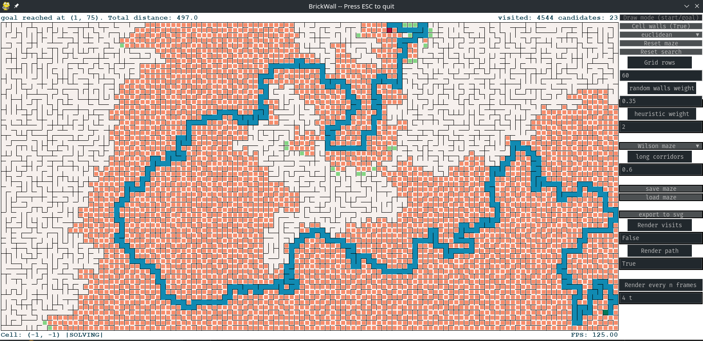

# BrickWall

BrickWall is a path planning simulation  and maze generation toy that uses the  A* algorithm to find paths through mazes 
that can either be drawn manually or generated automatically using various algorithms. The main feature is the 
visualisation of the maze generation and path finding process.
## Requirements 
BrickWall requires Python 3.6 as well as as the following packages that can be installed using pip.
1. cairosvg (2.4.2)  
2. depq (1.5.5) 
3. drawsvg (1.7.0) 
4. pygame_gui (0.5.7) 
5. pygame (1.9.6)
## Usage
### Interface
Brickwall starts with an empty grid in *paused* mode. You can unpause or pause the animation at any time by pressing 
the `<SPACE>` button. The first phase is the maze generation step which either finishes immediately (cell walls is FALSE)
or shows an animation of a perfect maze being generated one cell at a time. 
 
Once the maze is complete the simulator automatically pauses again. When un-paused it will start to find the shortest 
route from the start cell (indicated as a green square) to the goal cell (indicated as a red square). During path-finding
 the animation can be paused using `<SPACE>`. In *pause* mode extra information on the algorithm steps are provided in 
 the text box on the bottom-left corner of the maze grid (only during path-finding). The mouse can then be moved over 
 cells to show the f-score, g-score, and h-score used by the A* algorithm. One can also step through the solver steps
 manually by pressing `<s>`. When `<s>` is used to step through the solver steps the cell that is currently processed 
 is highlighted as a yellow box.
 
A new maze can be generated at any time by pressing `<r>`. This will reset the grid and pause the animation. If you 
only want to reset the path finding algorithm without resetting the maze this can be accomplished by pressing `<t>`. 
You can exit the program at any time by pressing `<ESC>`.
### Options and Features     
