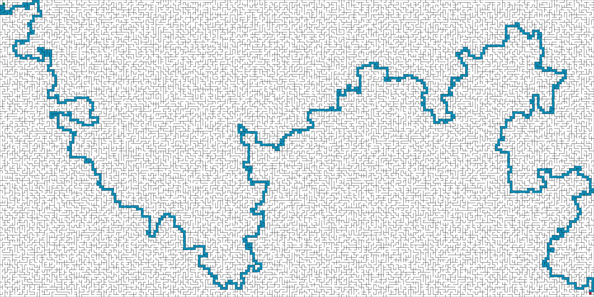
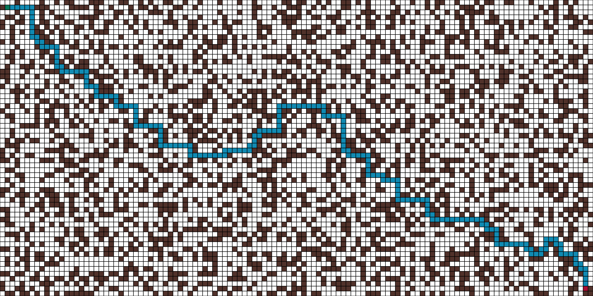

# BrickWall

BrickWall is a path planning simulation  and maze generation toy that uses the  A* algorithm to find paths through mazes 
that can either be drawn manually or generated automatically using various algorithms. The main feature is the 
visualisation of the maze generation and path finding process.
## Requirements 
BrickWall requires Python 3.6 as well as as the following packages that can be installed using pip.
1. cairosvg (2.4.2)  
2. depq (1.5.5) 
3. drawsvg (1.7.0) 
4. pygame_gui (0.5.7) 
5. pygame (1.9.6)
## Usage
### Interface
Brickwall starts with an empty grid in *paused* mode. You can unpause or pause the animation at any time by pressing 
the `<SPACE>` button. The first phase is the maze generation step which either finishes immediately (cell walls is FALSE)
or shows an animation of a perfect maze being generated one cell at a time. 
 
Once the maze is complete the simulator automatically pauses again. When un-paused it will start to find the shortest 
route from the start cell (indicated as a green square) to the goal cell (indicated as a red square). During path-finding
 the animation can be paused using `<SPACE>`. In *pause* mode extra information on the algorithm steps are provided in 
 the text box on the bottom-left corner of the maze grid (only during path-finding). The mouse can then be moved over 
 cells to show the f-score, g-score, and h-score used by the A* algorithm. One can also step through the solver steps
 manually by pressing `<s>`. When `<s>` is used to step through the solver steps the cell that is currently processed 
 is highlighted as a yellow box.
 
A new maze can be generated at any time by pressing `<r>`. This will reset the grid and pause the animation. If you 
only want to reset the path finding algorithm without resetting the maze this can be accomplished by pressing `<t>`. 
You can exit the program at any time by pressing `<ESC>`.
### Options and Features     
#### general settings
The starting point and goal of the maze can be moved to any cell by using the mouse in the cell grid.
`<LEFT_CLICK>` to set the start cell and `<RIGHT-CLICK>` to set the goal cell. This will only work 
if the draw-mode setting is set to *start/goal*. This setting can be changed by either pressing `<d>`
or toggling the *Draw mode* button. Note that this setting is locked to *start/goal* mode unless the
Walled cells setting is False.

The animation speed can be increased using the *Render every n frames* text box. This value defaults
to 1 which means every step is rendered but can be increased to dramatically speed up the animation.
This value can be increased by any amount but after about 30 the frame-rate starts to suffer and the 
speed does not increase further.  
#### maze construction settings
The first setting of note which is universal to all the following maze generation methods is the size
of the maze which can be set using the *Grid rows* text box. Note this only controls the number of
rows in the grid, the number of columns are always 2x the rows to maintain a constant maze shape. To
keep the layout of the interface nice and neat the number of rows are restricted to values that evenly
divide 720 (Factors: 2 x 2 x 2 x 2 x 3 x 3 x 5).

##### grid mazes
Two different kinds of mazes can be constructed. The first is the simplest and is constructed by 
considering each cell in the grid as either a wall or an empty space. The path solver may not enter
a wall cell and can only traverse through empty cells to find the goal. This is not the default mode 
but can be toggled using the *Walled cells* button. When it is set to False this mode is selected 
and mazes are created instantly by randomly filling the grid with walled cells. The frequency of walled
cells can be set using the *random walls weight* text box. If this value is 0 no walls will be added
and the grid will contain only empty cells. 

This mode is ideal for drawing custom mazes with the 
mouse and is the main intention of this setting. Walls can be drawn by holding down `<LEFT-CLICK>`
and dragging the mouse over the grid when the *Draw mode* setting is set to *Walls*. In the same way
walls can be deleted by holding down `<RIGHT-CLICK>`. 

##### walled mazes
The second kind of maze is usually more interesting to solve using the path finder and is 
constructed by considering each cell in the grid as an open space surrounded by four walls which can
either be open closed. There are therefore no cells that cannot be entered (unless all the walls are 
closed) but the path finder can only traverse into a cell if the wall between the current cell and 
that cell is open. This is the default mode and is indicated by the *Walled cells* toggle set to True.

The default maze generating algorithm in this mode is the growing tree maze generator. This 
algorithm can be tuned to produce mazes with long corridors like those produced by the recursive
backpropagation algorithm or produce mazes that tend to have lots of shorter twistier passages 
similar to those produced by Prim's algorithm. It can also randomly choose between these two 
options during generation which produces mazes that tend to have elements of both maze styles. The
generator's tendency to favour one style over the other can be set using the *long corridors* text 
box. This value ranges from 0 to 1 and smaller values favour twisty mazes similar to Prim's algorithm
while larger numbers act like a recursive backpropagation generator.

The growing tree maze generator always creates perfect mazes meaning all cells in the grid are
accessible to all other cells and there is only one path from any two cells but the maze is biased 
towards a style which can be controlled using the *long corridors* text box. To generate completely
unbiased random mazes one can use the drop down box above the *long corridors* text box to choose 
Wilson's algorithm as the maze generator. This algorithm generates mazes in a completely different 
way and is based on random walks between cells. It can take a very long time to complete converges
slowly, especially at the beginning of the process. It is recommended to set *render every n frames*
to 20 or 30 when using this option.

#### path finding settings
The shortest path between the start cell and the goal cell is found using the A* algorithm. The 
heuristic distance measure can be chosen to be either Euclidean or Manhattan by using the drop-down 
box under the *cell walls* toggle button.

When using the *Cell walls* setting is set to False one can construct mazes with multiple paths to
the goal with some shorter than others. When the *heuristic weight* option is set to 1 the A* 
algorithm is guaranteed to find the shortest route but may have to visit many of the cells in the 
maze to find this route. Faster convergence can be accomplished by increasing this value which 
guides the solver towards the goal faster but may result in longer routes as it is now no longer
guaranteed that the shortest route will be found.  
#### saving and exporting mazes
The maze as well as the solver state can be saved to disk and loaded back without needing to wait 
for it to generate again by using the *save maze* and *load maze* buttons. The state of the solver
is also saved so one can pause the solver mid-solving, save the maze, load it back up later, and 
continue solving.

Mazes along with their solution can also be exported as images, both as vector graphics (.svg) and 
raster graphics (.png) by using the *export to svg* button. Note that due to the potential size of
the maze this saving process can take several seconds and lock up the interface. You just have to 
be patient as there is currently no easy way to add a progress bar for this kind of operation.
### Examples
A large maze generated using Wilson's algorithm.

A simple maze constructed from open cells and obstructed cells (*cell walls* set to False).  

### Bugs and Issues
Pressing `<s>` to step through the path finding algorithm steps sometimes has unexpected behaviour 
(sometimes crashing to terminal) after a maze has been traversed several times. This is likely a 
bug in the interface. 